<!-- View this in this website https://mermaidviewer.com/ perfect for diagrams of architecture -->

# Movies App - Product Requirements Document (PRD) Diagrams

## 1. System Architecture Overview

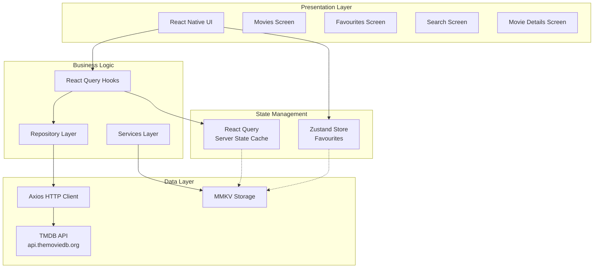

## 2. Application Navigation Flow

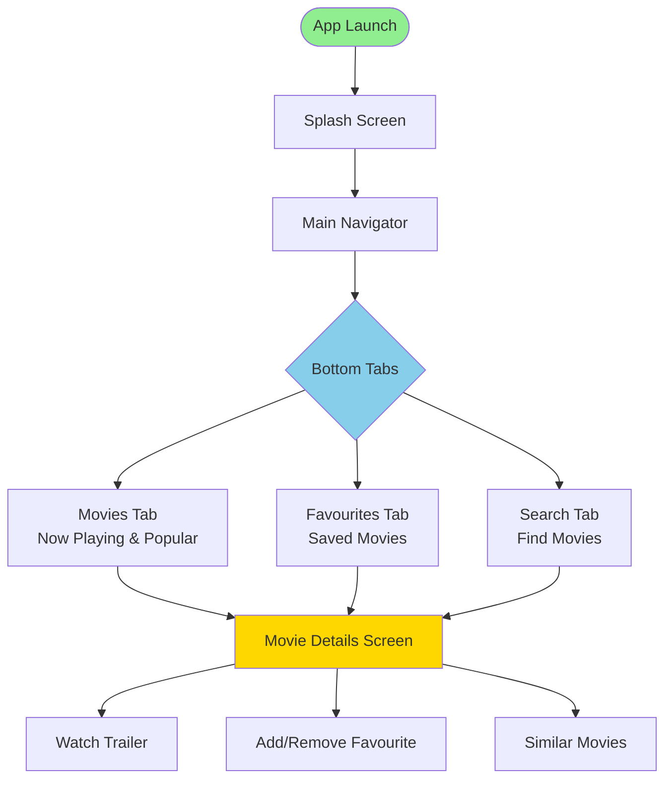

## 3. Feature Architecture

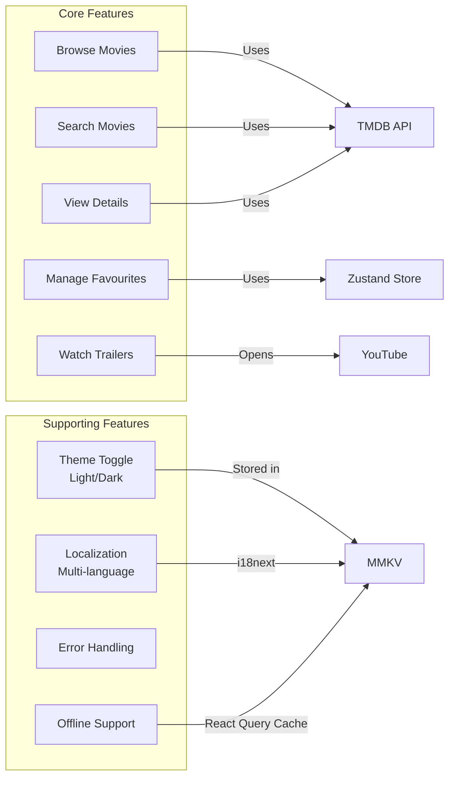

## 4. Data Flow - Movie Browsing

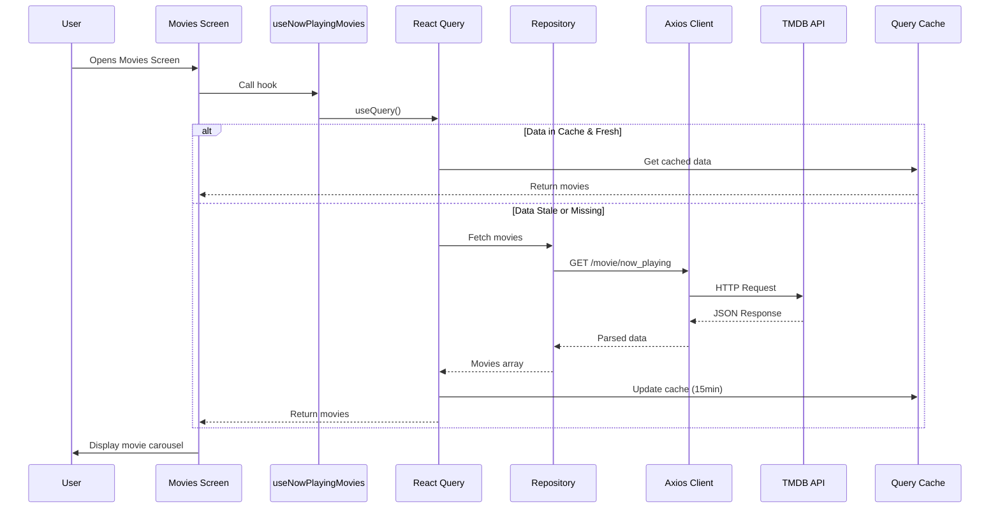

## 5. Data Flow - Favourites Management

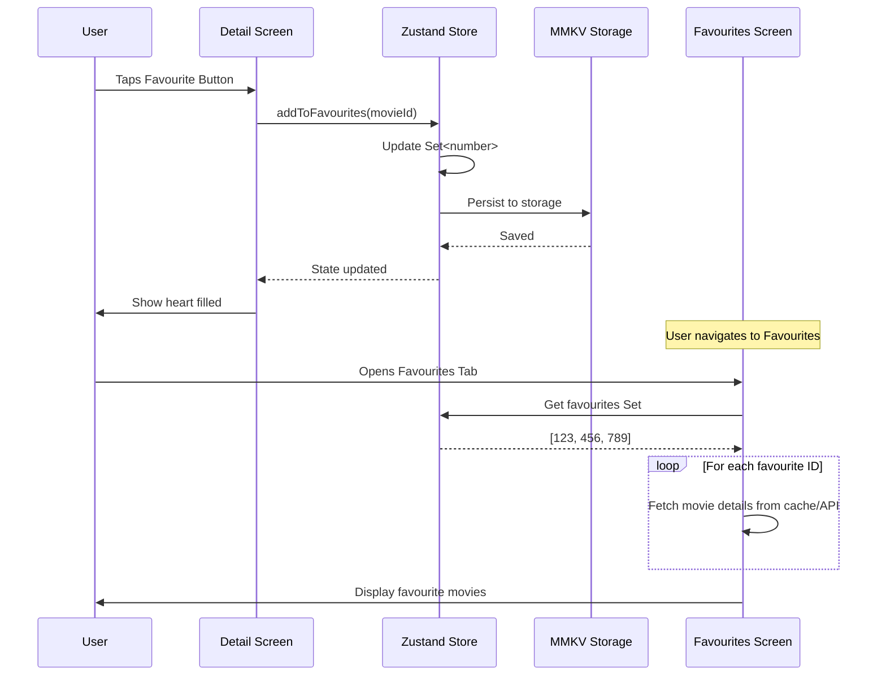

## 6. Component Hierarchy

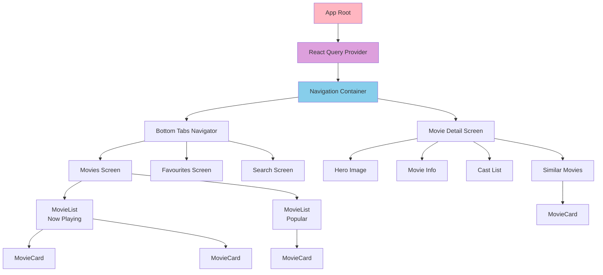

## 7. State Management Strategy

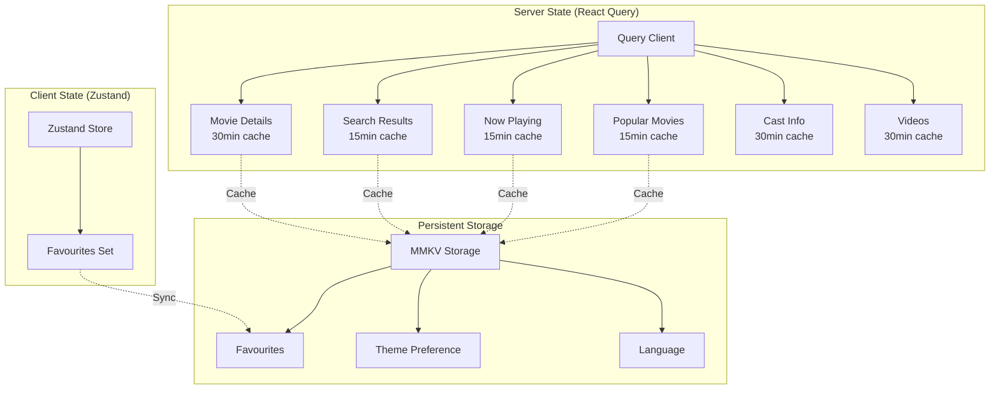

## 8. API Integration Architecture

```mermaid
graph LR
    subgraph "React Query Hooks"
        H1[usePopularMovies]
        H2[useNowPlayingMovies]
        H3[useSearchMovies]
        H4[useMovieDetails]
        H5[useMovieCast]
        H6[useMovieVideos]
    end

    subgraph "Repository Layer"
        R[Movies Repository]
    end

    subgraph "API Endpoints"
        E1[/movie/popular]
        E2[/movie/now_playing]
        E3[/search/movie]
        E4[/movie/:id]
        E5[/movie/:id/credits]
        E6[/movie/:id/videos]
    end

    subgraph "External API"
        TMDB[TMDB API<br/>api.themoviedb.org/3]
    end

    H1 --> R
    H2 --> R
    H3 --> R
    H4 --> R
    H5 --> R
    H6 --> R

    R --> E1
    R --> E2
    R --> E3
    R --> E4
    R --> E5
    R --> E6

    E1 --> TMDB
    E2 --> TMDB
    E3 --> TMDB
    E4 --> TMDB
    E5 --> TMDB
    E6 --> TMDB
```

## 9. Caching Strategy

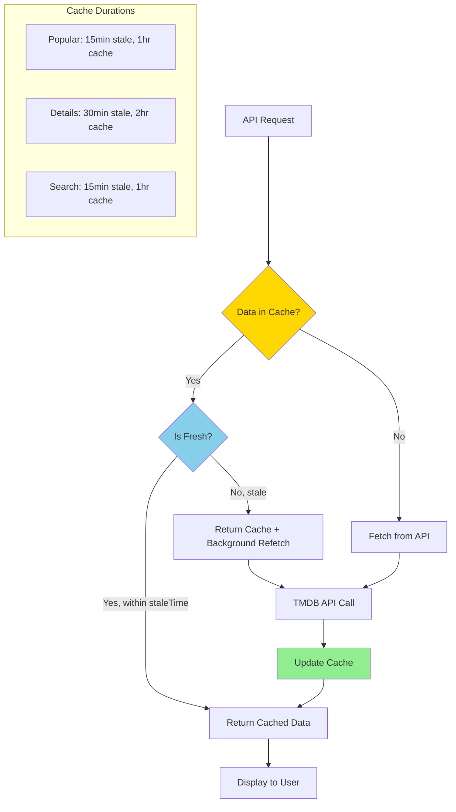

## 10. User Journey - Complete Flow

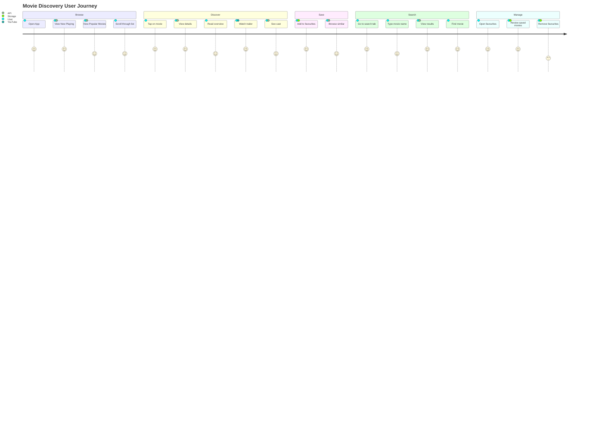

## 11. Error Handling Flow

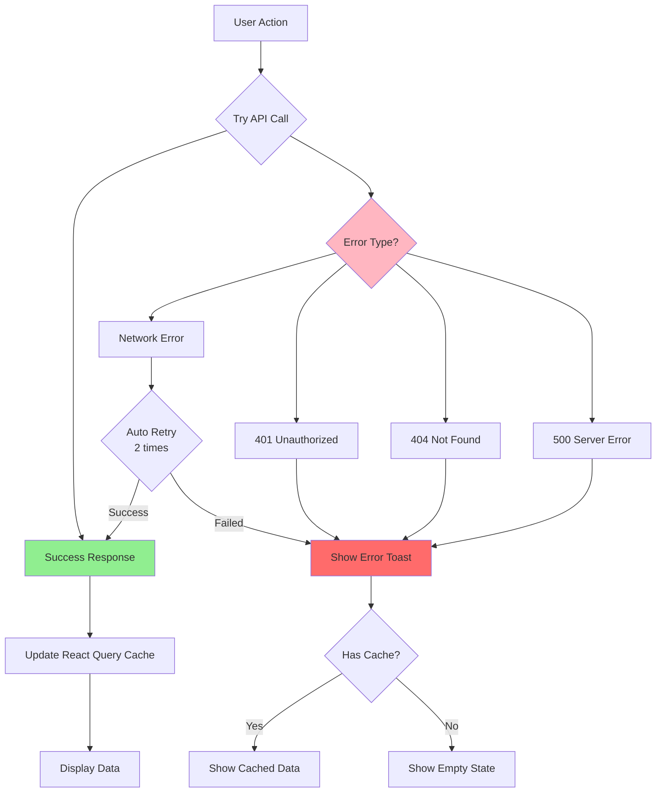

## 12. Technology Stack

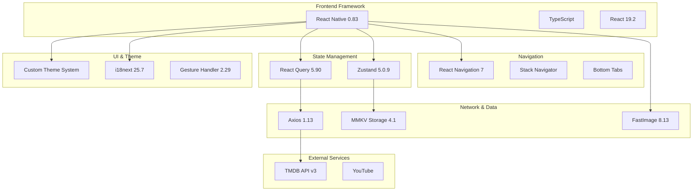

---

## Key Features Summary

### Functional Requirements

1. **Browse Movies**: Now Playing (carousel), Popular (list)
2. **Search**: Real-time search with debounce
3. **Movie Details**: Full info, cast, trailers, similar movies
4. **Favourites**: Add/remove/view saved movies
5. **Themes**: Light/Dark mode toggle

### Non-Functional Requirements

1. **Performance**: 15-30 min caching strategy
2. **Offline Support**: React Query cache persistence
3. **Error Handling**: Toast notifications, retry logic
4. **Accessibility**: Localization support
5. **Scalability**: Repository pattern, modular architecture

### Technical Constraints

- TMDB API rate limits (cached to prevent abuse)
- Mobile-first design (iOS/Android)
- TypeScript strict mode
- React Native 0.83 compatibility
